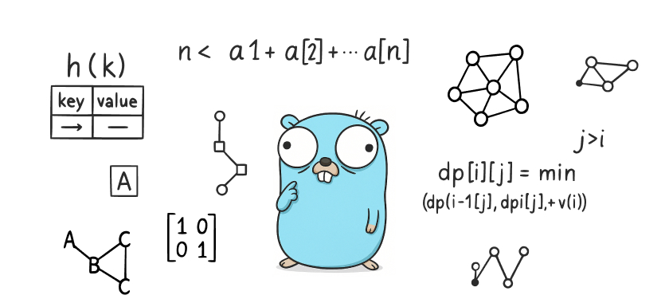

# Я.Практикум - алгоритмы и структуры данных

> ДИСКЛЕЙМЕР >>>
> 
> Автор не несет ответственности за точность, полноту или качество предоставленной информации. 
> Не рекомендуется использование решений из данного репозитория во время обучения - вы подрываете
> собственные знания и развитие навыков программирования ;)

В этом репозитории я буду собирать задачи (из Контеста) по спринтам и финальные задания спринтов, 
в рамках обучения по курсу [Алгоритмы и структуры данных](https://practicum.yandex.ru/algorithms/) от Я.Практикума.

По мере прохождения обучения (и после) решения будут пополняться.

### Спринт 1. Введение в алгоритмы

  
Практические задачи

  - [x] [A. Значения функции](sprint_1/tasks/A)
  - [x] [B. Чётные и нечётные числа](sprint_1/tasks/B)
  - [ ] [C. Соседи](sprint_1/tasks/C)
  - [ ] [D. Хаотичность погоды](sprint_1/tasks/D)
  - [x] [E. Самое длинное слово](sprint_1/tasks/E)
  - [x] [F. Палиндром](sprint_1/tasks/F)
  - [x] [G. Работа из дома](sprint_1/tasks/G)
  - [x] [H. Двоичная система](sprint_1/tasks/H)
  - [x] [I. Степень четырёх](sprint_1/tasks/I)
  - [x] [J. Факторизация](sprint_1/tasks/J)
  - [ ] [K. Списочная форма](sprint_1/tasks/K)
  - [x] [L. Лишняя буква](sprint_1/tasks/L)

  
Финальные задачи

  - [x] [A. Ближайший ноль](sprint_1/final/A)
  - [x] [B. Ловкость рук](sprint_1/final/B)

### Спринт 2. Основные структуры данных

  
Практические задачи

    
  - [x] [A. Мониторинг](sprint_2/tasks/A)
  - [ ] [B. Список дел](sprint_2/tasks/B)
  - [ ] [C. Нелюбимое дело](sprint_2/tasks/C)
  - [x] [D. Заботливая мама](sprint_2/tasks/D)
  - [x] [E. Всё наоборот](sprint_2/tasks/E)
  - [x] [F. Стек-Max](sprint_2/tasks/F)
  - [x] [G. Стек-MaxEffective](sprint_2/tasks/G)
  - [x] [H. Скобочная последовательность](sprint_2/tasks/H)
  - [x] [I. Ограниченная очередь](sprint_2/tasks/I)
  - [x] [J. Списочная очередь](sprint_2/tasks/J)
  - [x] [K. Рекурсивные числа Фибоначчи](sprint_2/tasks/K)
  - [x] [L. Фибоначчи по модулю](sprint_2/tasks/L)

  
Финальные задачи

  - [x] [A. Дек](sprint_2/final/A)
  - [x] [B. Калькулятор](sprint_2/final/B)

### Спринт 3. Рекурсия и сортировки

  
Практические задачи

  - [x] [A. Генератор скобок](sprint_3/tasks/A)
  - [x] [B. Комбинации](sprint_3/tasks/B)
  - [x] [C. Подпоследовательность](sprint_3/tasks/C)
  - [x] [D. Печеньки](sprint_3/tasks/D)
  - [ ] [E. Покупка домов](sprint_3/tasks/E)
  - [ ] [F. Периметр треугольника](sprint_3/tasks/F)
  - [x] [G. Гардероб](sprint_3/tasks/G)
  - [x] [H. Большое число](sprint_3/tasks/H)
  - [ ] [I. Любители конференций](sprint_3/tasks/I)
  - [x] [J. Пузырёк](sprint_3/tasks/J)
  - [x] [K. Сортировка слиянием](sprint_3/tasks/K)
  - [ ] [M. Золотая середина](sprint_3/tasks/M)
  - [ ] [N. Клумбы](sprint_3/tasks/N)
  - [ ] [O. Разность треш-индексов](sprint_3/tasks/O)
  - [x] [P. Частичная сортировка](sprint_3/tasks/P)

  
Финальные задачи

  - [x] [A. Поиск в сломанном массиве](sprint_3/final/A)
  - [x] [B. Эффективная быстрая сортировка](sprint_3/final/B)

### Спринт 4. Хеш-функции и хеш-таблицы

  
Практические задачи

  - [x] [A. Полиномиальный хеш](sprint_4/tasks/A)
  - [ ] [B. Сломай меня](sprint_4/tasks/B)
  - [x] [C. Префиксные хеши](sprint_4/tasks/C)
  - [x] [D. Кружки](sprint_4/tasks/D)
  - [x] [E. Подстроки](sprint_4/tasks/E)
  - [ ] [F. Анаграммная группировка](sprint_4/tasks/F)
  - [x] [G. Соревнование](sprint_4/tasks/G)
  - [x] [H. Странное сравнение](sprint_4/tasks/H)
  - [x] [I. Общий подмассив](sprint_4/tasks/I)
  - [x] [J. Сумма четвёрок](sprint_4/tasks/J)
  - [ ] [K. Ближайшая остановка](sprint_4/tasks/K)
  - [ ] [L. МногоГоша](sprint_4/tasks/L)

  
Финальные задачи

  - [x] [A. Поисковая система](sprint_4/final/A)
  - [x] [B. Хеш-таблица](sprint_4/final/B)

### Спринт 5. Деревья

  
Практические задачи

  - [x] [A. Лампочки](sprint_5/tasks/A)
  - [x] [B. Сбалансированное дерево](sprint_5/tasks/B)
  - [x] [C. Дерево - анаграмма](sprint_5/tasks/C)
  - [ ] [D. Деревья - близнецы](sprint_5/tasks/D)
  - [ ] [E. Дерево поиска](sprint_5/tasks/E)
  - [x] [F. Максимальная глубина](sprint_5/tasks/F)
  - [ ] [G. Максимальный путь в дереве](sprint_5/tasks/G)
  - [ ] [H. Числовые пути](sprint_5/tasks/H)
  - [ ] [I. Разные деревья поиска](sprint_5/tasks/I)
  - [x] [J. Добавь узел](sprint_5/tasks/J)
  - [x] [K. Выведи диапазон](sprint_5/tasks/K)
  - [x] [L. Просеивание вниз](sprint_5/tasks/L)
  - [x] [M. Просеивание вверх](sprint_5/tasks/M)
  - [x] [N. Разбиение дерева](sprint_5/tasks/N)

  
Финальные задачи

  - [x] [A. Пирамидальная сортировка](sprint_5/final/A)
  - [x] [B. Удали узел](sprint_5/final/B)

### Спринт 6. Графы

  
Практические задачи

  - [x] [A. Построить список смежности](sprint_6/tasks/A)
  - [x] [B. Перевести список ребер в матрицу смежности](sprint_6/tasks/B)
  - [x] [C. DFS](sprint_6/tasks/C)
  - [x] [D. BFS](sprint_6/tasks/D)
  - [ ] [E. Компоненты связности](sprint_6/tasks/E)
  - [ ] [F. Расстояние между вершинами](sprint_6/tasks/F)
  - [ ] [G. Максимальное расстояние](sprint_6/tasks/G)
  - [ ] [H. Время выходить](sprint_6/tasks/H)
  - [x] [J. Топологическая сортировка](sprint_6/tasks/J)
  - [ ] [K. Достопримечательности](sprint_6/tasks/K)
  - [x] [L. Полный граф](sprint_6/tasks/L)
  - [x] [M. Проверка на двудольность](sprint_6/tasks/M)

  
Финальные задачи

  - [x] [A. Дорогая сеть](sprint_6/final/A)
  - [x] [B. Железные дороги](sprint_6/final/B)

### Спринт 7. Жадные алгоритмы и динамическое программирование

  
Практические задачи

    
  - [x] [A. Биржа](sprint_7/tasks/A)
  - [ ] [B. Расписание](sprint_7/tasks/B)
  - [x] [C. Золотая лихорадка](sprint_7/tasks/C)
  - [x] [D. Числа Фибоначчи для взрослых](sprint_7/tasks/D)
  - [x] [E. Алла на Алгосах](sprint_7/tasks/E)
  - [x] [F. Прыжки по лестнице](sprint_7/tasks/F)
  - [ ] [G. Банкомат](sprint_7/tasks/G)
  - [x] [H. Поле с цветочками](sprint_7/tasks/H)
  - [ ] [I. Сложное поле с цветочками](sprint_7/tasks/I)
  - [ ] [J. Путешествие](sprint_7/tasks/J)
  - [ ] [K. Гороскопы](sprint_7/tasks/K)
  - [x] [L. Золото лепреконов](sprint_7/tasks/L)
  - [x] [M. Рюкзак](sprint_7/tasks/M)
  - [ ] [N. Гоша в ресторане](sprint_7/tasks/N)
  - [x] [O. Количество путей](sprint_7/tasks/O)

  
Финальные задачи

  - [x] [A. Расстояние по Левенштейну](sprint_7/final/A)
  - [x] [B. Одинаковые суммы](sprint_7/final/B)

### Спринт 8. Алгоритмы на строках

  
Практические задачи

  - [x] [A. Разворот строки](sprint_8/tasks/A)
  - [ ] [B. Пограничный контроль](sprint_8/tasks/B)
  - [ ] [C. Самый длинный палиндром 2](sprint_8/tasks/C)
  - [x] [D. Общий префикс](sprint_8/tasks/D)
  - [ ] [E. Вставка строк](sprint_8/tasks/E)
  - [x] [F. Частое слово](sprint_8/tasks/F)
  - [x] [G. Поиск со сдвигом](sprint_8/tasks/G)
  - [x] [H. Глобальная замена](sprint_8/tasks/H)
  - [x] [I. Повтор](sprint_8/tasks/I)
  - [ ] [J. Случай верблюда](sprint_8/tasks/J)
  - [x] [K. Сравнить две строки](sprint_8/tasks/K)
  - [x] [L. Подсчёт префикс-функции](sprint_8/tasks/L)

  
Финальные задачи

  - [x] [A. Packed Prefix](sprint_8/final/A)
  - [x] [B. Шпаргалка](sprint_8/final/B)

### Дополнительно

  
Задачи для подготовки к собеседованию

  - [X] [A. A+B](sprint_interview/A)
  - [ ] [B. Card Counter](sprint_interview/B)
  - [ ] [C. Статус 200](sprint_interview/C)
  - [ ] [D. Matrix. Resurrection](sprint_interview/D)
  - [ ] [E. Римлянин](sprint_interview/E)
  - [ ] [F. Хорошие строки](sprint_interview/F)
  - [ ] [G. Пути в дереве](sprint_interview/G)
  - [ ] [H. Сизиф](sprint_interview/H)
  - [ ] [I. Частичный разворот](sprint_interview/I)
  - [ ] [J. Ферзи](sprint_interview/J)
  - [ ] [K. Разрыв шаблона](sprint_interview/K)
  - [ ] [L. Пересечение отрезков](sprint_interview/L)
  - [ ] [M. Массив юрского периода](sprint_interview/M)
  - [ ] [N. Атака клонов](sprint_interview/N)
  - [ ] [O. Монополия++](sprint_interview/O)
  - [ ] [P. Граница дерева](sprint_interview/P)
  - [ ] [Q. Прямота](sprint_interview/Q)
  - [ ] [R. Паша и Марк](sprint_interview/R)
  - [ ] [S. По ip вычислю](sprint_interview/S)
  - [ ] [T. XORошая задача](sprint_interview/T)
  - [ ] [U. Опять скобочные последовательности](sprint_interview/U)

  
Задачи с Leetcode

  

