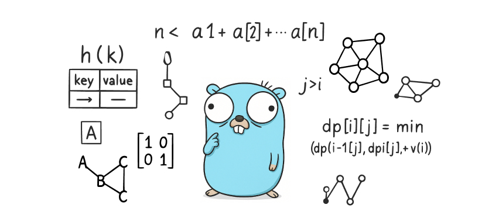

# Алгоритмы и Структуры данных

> ДИСКЛЕЙМЕР >>>
>
> Автор не несет ответственности за точность, полноту или качество предоставленной информации. 
> Не рекомендуется использование решений из данного репозитория во время обучения - вы подрываете
> собственные знания и развитие навыков программирования ;)

В этом репозитории я буду собирать задачи по спринтам и финальные задания спринтов,
в рамках обучения по курсу [Алгоритмы и структуры данных](https://practicum.yandex.ru/algorithms/) от [Я.Практикума](https://practicum.yandex.ru).

По мере прохождения обучения (и после) решения будут пополняться.
В дальнейшем, задачи будут пополняться из [LeetCode](https://leetcode.com), [Яндекс Тренировки](https://yandex.ru/yaintern/algorithm-training_1), [CodeWars](https://www.codewars.com) и др.

### Быстрый переход к разделу

- [Тестирование](#tests)
- [Курс Яндекс.Практикум](#yandex)
- [Курс Тинькофф](#tinkoff)
- [Яндекс тренировки 1.0](#yandex_train_1)
- [Яндекс тренировки 2.0](#yandex_train_2)
- [Яндекс тренировки 3.0](#yandex_train_3)
- [LeetCode](#leetcode)
- [CodeWars](#codewars)

 

## Тестирование

Каждое решение обложено простыми тестами (при желении их можно расширить).

Финальный  прогон тестов проходит при `push` в репозиторий, где срабатывает Github Actions и статус тестов отображается переменной `tests`.

 

## Яндекс Практикум, курс Алгоритмы и структуры данных

#### Спринт 1. Введение в алгоритмы

  
Практические задачи

- [x] [A. Значения функции](yandex_practicum/sprint_1/tasks/A)
- [x] [B. Чётные и нечётные числа](yandex_practicum/sprint_1/tasks/B)
- [ ] [C. Соседи](yandex_practicum/sprint_1/tasks/C)
- [ ] [D. Хаотичность погоды](yandex_practicum/sprint_1/tasks/D)
- [x] [E. Самое длинное слово](yandex_practicum/sprint_1/tasks/E)
- [x] [F. Палиндром](yandex_practicum/sprint_1/tasks/F)
- [x] [G. Работа из дома](yandex_practicum/sprint_1/tasks/G)
- [x] [H. Двоичная система](yandex_practicum/sprint_1/tasks/H)
- [x] [I. Степень четырёх](yandex_practicum/sprint_1/tasks/I)
- [x] [J. Факторизация](yandex_practicum/sprint_1/tasks/J)
- [ ] [K. Списочная форма](yandex_practicum/sprint_1/tasks/K)
- [x] [L. Лишняя буква](yandex_practicum/sprint_1/tasks/L)

  
Финальные задачи

- [x] [A. Ближайший ноль](yandex_practicum/sprint_1/final/A)
- [x] [B. Ловкость рук](yandex_practicum/sprint_1/final/B)

#### Спринт 2. Основные структуры данных

  
Практические задачи

- [x] [A. Мониторинг](yandex_practicum/sprint_2/tasks/A)
- [ ] [B. Список дел](yandex_practicum/sprint_2/tasks/B)
- [ ] [C. Нелюбимое дело](yandex_practicum/sprint_2/tasks/C)
- [x] [D. Заботливая мама](yandex_practicum/sprint_2/tasks/D)
- [x] [E. Всё наоборот](yandex_practicum/sprint_2/tasks/E)
- [x] [F. Стек-Max](yandex_practicum/sprint_2/tasks/F)
- [x] [G. Стек-MaxEffective](yandex_practicum/sprint_2/tasks/G)
- [x] [H. Скобочная последовательность](yandex_practicum/sprint_2/tasks/H)
- [x] [I. Ограниченная очередь](yandex_practicum/sprint_2/tasks/I)
- [x] [J. Списочная очередь](yandex_practicum/sprint_2/tasks/J)
- [x] [K. Рекурсивные числа Фибоначчи](yandex_practicum/sprint_2/tasks/K)
- [x] [L. Фибоначчи по модулю](yandex_practicum/sprint_2/tasks/L)

  
Финальные задачи

- [x] [A. Дек](yandex_practicum/sprint_2/final/A)
- [x] [B. Калькулятор](yandex_practicum/sprint_2/final/B)

#### Спринт 3. Рекурсия и сортировки

  
Практические задачи

- [x] [A. Генератор скобок](yandex_practicum/sprint_3/tasks/A)
- [x] [B. Комбинации](yandex_practicum/sprint_3/tasks/B)
- [x] [C. Подпоследовательность](yandex_practicum/sprint_3/tasks/C)
- [x] [D. Печеньки](yandex_practicum/sprint_3/tasks/D)
- [ ] [E. Покупка домов](yandex_practicum/sprint_3/tasks/E)
- [ ] [F. Периметр треугольника](yandex_practicum/sprint_3/tasks/F)
- [x] [G. Гардероб](yandex_practicum/sprint_3/tasks/G)
- [x] [H. Большое число](yandex_practicum/sprint_3/tasks/H)
- [ ] [I. Любители конференций](yandex_practicum/sprint_3/tasks/I)
- [x] [J. Пузырёк](yandex_practicum/sprint_3/tasks/J)
- [x] [K. Сортировка слиянием](yandex_practicum/sprint_3/tasks/K)
- [ ] [M. Золотая середина](yandex_practicum/sprint_3/tasks/M)
- [ ] [N. Клумбы](yandex_practicum/sprint_3/tasks/N)
- [ ] [O. Разность треш-индексов](yandex_practicum/sprint_3/tasks/O)
- [x] [P. Частичная сортировка](yandex_practicum/sprint_3/tasks/P)

  
Финальные задачи

- [x] [A. Поиск в сломанном массиве](yandex_practicum/sprint_3/final/A)
- [x] [B. Эффективная быстрая сортировка](yandex_practicum/sprint_3/final/B)

#### Спринт 4. Хеш-функции и хеш-таблицы

  
Практические задачи

- [x] [A. Полиномиальный хеш](yandex_practicum/sprint_4/tasks/A)
- [ ] [B. Сломай меня](yandex_practicum/sprint_4/tasks/B)
- [x] [C. Префиксные хеши](yandex_practicum/sprint_4/tasks/C)
- [x] [D. Кружки](yandex_practicum/sprint_4/tasks/D)
- [x] [E. Подстроки](yandex_practicum/sprint_4/tasks/E)
- [ ] [F. Анаграммная группировка](yandex_practicum/sprint_4/tasks/F)
- [x] [G. Соревнование](yandex_practicum/sprint_4/tasks/G)
- [x] [H. Странное сравнение](yandex_practicum/sprint_4/tasks/H)
- [x] [I. Общий подмассив](yandex_practicum/sprint_4/tasks/I)
- [x] [J. Сумма четвёрок](yandex_practicum/sprint_4/tasks/J)
- [ ] [K. Ближайшая остановка](yandex_practicum/sprint_4/tasks/K)
- [ ] [L. МногоГоша](yandex_practicum/sprint_4/tasks/L)

  
Финальные задачи

- [x] [A. Поисковая система](yandex_practicum/sprint_4/final/A)
- [x] [B. Хеш-таблица](yandex_practicum/sprint_4/final/B)

#### Спринт 5. Деревья

  
Практические задачи

- [x] [A. Лампочки](yandex_practicum/sprint_5/tasks/A)
- [x] [B. Сбалансированное дерево](yandex_practicum/sprint_5/tasks/B)
- [x] [C. Дерево - анаграмма](yandex_practicum/sprint_5/tasks/C)
- [ ] [D. Деревья - близнецы](yandex_practicum/sprint_5/tasks/D)
- [ ] [E. Дерево поиска](yandex_practicum/sprint_5/tasks/E)
- [x] [F. Максимальная глубина](yandex_practicum/sprint_5/tasks/F)
- [ ] [G. Максимальный путь в дереве](yandex_practicum/sprint_5/tasks/G)
- [ ] [H. Числовые пути](yandex_practicum/sprint_5/tasks/H)
- [ ] [I. Разные деревья поиска](yandex_practicum/sprint_5/tasks/I)
- [x] [J. Добавь узел](yandex_practicum/sprint_5/tasks/J)
- [x] [K. Выведи диапазон](yandex_practicum/sprint_5/tasks/K)
- [x] [L. Просеивание вниз](yandex_practicum/sprint_5/tasks/L)
- [x] [M. Просеивание вверх](yandex_practicum/sprint_5/tasks/M)
- [x] [N. Разбиение дерева](yandex_practicum/sprint_5/tasks/N)

  
Финальные задачи

- [x] [A. Пирамидальная сортировка](yandex_practicum/sprint_5/final/A)
- [x] [B. Удали узел](yandex_practicum/sprint_5/final/B)

#### Спринт 6. Графы

  
Практические задачи

- [x] [A. Построить список смежности](yandex_practicum/sprint_6/tasks/A)
- [x] [B. Перевести список ребер в матрицу смежности](yandex_practicum/sprint_6/tasks/B)
- [x] [C. DFS](yandex_practicum/sprint_6/tasks/C)
- [x] [D. BFS](yandex_practicum/sprint_6/tasks/D)
- [ ] [E. Компоненты связности](yandex_practicum/sprint_6/tasks/E)
- [ ] [F. Расстояние между вершинами](yandex_practicum/sprint_6/tasks/F)
- [ ] [G. Максимальное расстояние](yandex_practicum/sprint_6/tasks/G)
- [ ] [H. Время выходить](yandex_practicum/sprint_6/tasks/H)
- [x] [J. Топологическая сортировка](yandex_practicum/sprint_6/tasks/J)
- [ ] [K. Достопримечательности](yandex_practicum/sprint_6/tasks/K)
- [x] [L. Полный граф](yandex_practicum/sprint_6/tasks/L)
- [x] [M. Проверка на двудольность](yandex_practicum/sprint_6/tasks/M)

  
Финальные задачи

- [x] [A. Дорогая сеть](yandex_practicum/sprint_6/final/A)
- [x] [B. Железные дороги](yandex_practicum/sprint_6/final/B)

#### Спринт 7. Жадные алгоритмы и динамическое программирование

  
Практические задачи

- [x] [A. Биржа](yandex_practicum/sprint_7/tasks/A)
- [ ] [B. Расписание](yandex_practicum/sprint_7/tasks/B)
- [x] [C. Золотая лихорадка](yandex_practicum/sprint_7/tasks/C)
- [x] [D. Числа Фибоначчи для взрослых](yandex_practicum/sprint_7/tasks/D)
- [x] [E. Алла на Алгосах](yandex_practicum/sprint_7/tasks/E)
- [x] [F. Прыжки по лестнице](yandex_practicum/sprint_7/tasks/F)
- [ ] [G. Банкомат](yandex_practicum/sprint_7/tasks/G)
- [x] [H. Поле с цветочками](yandex_practicum/sprint_7/tasks/H)
- [ ] [I. Сложное поле с цветочками](yandex_practicum/sprint_7/tasks/I)
- [ ] [J. Путешествие](yandex_practicum/sprint_7/tasks/J)
- [ ] [K. Гороскопы](yandex_practicum/sprint_7/tasks/K)
- [x] [L. Золото лепреконов](yandex_practicum/sprint_7/tasks/L)
- [x] [M. Рюкзак](yandex_practicum/sprint_7/tasks/M)
- [ ] [N. Гоша в ресторане](yandex_practicum/sprint_7/tasks/N)
- [x] [O. Количество путей](yandex_practicum/sprint_7/tasks/O)

  
Финальные задачи

- [x] [A. Расстояние по Левенштейну](yandex_practicum/sprint_7/final/A)
- [x] [B. Одинаковые суммы](yandex_practicum/sprint_7/final/B)

#### Спринт 8. Алгоритмы на строках

  
Практические задачи

- [x] [A. Разворот строки](yandex_practicum/sprint_8/tasks/A)
- [ ] [B. Пограничный контроль](yandex_practicum/sprint_8/tasks/B)
- [ ] [C. Самый длинный палиндром 2](yandex_practicum/sprint_8/tasks/C)
- [x] [D. Общий префикс](yandex_practicum/sprint_8/tasks/D)
- [ ] [E. Вставка строк](yandex_practicum/sprint_8/tasks/E)
- [x] [F. Частое слово](yandex_practicum/sprint_8/tasks/F)
- [x] [G. Поиск со сдвигом](yandex_practicum/sprint_8/tasks/G)
- [x] [H. Глобальная замена](yandex_practicum/sprint_8/tasks/H)
- [x] [I. Повтор](yandex_practicum/sprint_8/tasks/I)
- [ ] [J. Случай верблюда](yandex_practicum/sprint_8/tasks/J)
- [x] [K. Сравнить две строки](yandex_practicum/sprint_8/tasks/K)
- [x] [L. Подсчёт префикс-функции](yandex_practicum/sprint_8/tasks/L)

  
Финальные задачи

- [x] [A. Packed Prefix](yandex_practicum/sprint_8/final/A)
- [x] [B. Шпаргалка](yandex_practicum/sprint_8/final/B)

#### Дополнительно

  
Задачи для подготовки к собеседованию

- [X] [A. A+B](yandex_practicum/sprint_interview/A)
- [ ] [B. Card Counter](yandex_practicum/sprint_interview/B)
- [ ] [C. Статус 200](yandex_practicum/sprint_interview/C)
- [ ] [D. Matrix. Resurrection](yandex_practicum/sprint_interview/D)
- [ ] [E. Римлянин](yandex_practicum/sprint_interview/E)
- [ ] [F. Хорошие строки](yandex_practicum/sprint_interview/F)
- [ ] [G. Пути в дереве](yandex_practicum/sprint_interview/G)
- [ ] [H. Сизиф](yandex_practicum/sprint_interview/H)
- [ ] [I. Частичный разворот](yandex_practicum/sprint_interview/I)
- [ ] [J. Ферзи](yandex_practicum/sprint_interview/J)
- [ ] [K. Разрыв шаблона](yandex_practicum/sprint_interview/K)
- [ ] [L. Пересечение отрезков](yandex_practicum/sprint_interview/L)
- [ ] [M. Массив юрского периода](yandex_practicum/sprint_interview/M)
- [ ] [N. Атака клонов](yandex_practicum/sprint_interview/N)
- [ ] [O. Монополия++](yandex_practicum/sprint_interview/O)
- [ ] [P. Граница дерева](yandex_practicum/sprint_interview/P)
- [ ] [Q. Прямота](yandex_practicum/sprint_interview/Q)
- [ ] [R. Паша и Марк](yandex_practicum/sprint_interview/R)
- [ ] [S. По ip вычислю](yandex_practicum/sprint_interview/S)
- [ ] [T. XORошая задача](yandex_practicum/sprint_interview/T)
- [ ] [U. Опять скобочные последовательности](yandex_practicum/sprint_interview/U)

 

## Tinkoff, курс Алгоритмы и структуры данных

  
Линейные структуры, сортировки

- [ ] [A. Анаграммы](tinkoff/1/A)
- [ ] [Простая очередь](tinkoff/1/2)
- [ ] [Постфиксная запись](tinkoff/1/3)
- [ ] [Кошмар в замке](tinkoff/1/4)
- [ ] [Гоблины и очереди](tinkoff/1/5)
- [ ] [Число](tinkoff/1/6)

  
Оптимальные сортировки и поиски за логарифм

- [ ] [Count me in](tinkoff/2/1)
- [ ] [Инверсии](tinkoff/2/2)
- [ ] [Минимизируем максимум](tinkoff/2/3)
- [ ] [Дремучий лес](tinkoff/2/4)

  
Динамическое программирование

- [ ] [Калькулятор](tinkoff/3/1)
- [ ] [Конём ходи!](tinkoff/3/2)
- [ ] [Наибольший квадрат](tinkoff/3/3)
- [ ] [Гвоздики](tinkoff/3/4)
- [ ] [Лесенки](tinkoff/3/5)

  
Графы, DFS

- [ ] [Дерево?](tinkoff/4/1)
- [ ] [Компоненты связности](tinkoff/4/2)
- [ ] [Удаление клеток](tinkoff/4/3)
- [ ] [Получи дерево](tinkoff/4/4)
- [ ] [Долой списывани!](tinkoff/4/5)
- [ ] [Есть ли цикл?](tinkoff/4/6)
- [ ] [Свинки-копилки](tinkoff/4/7)
- [ ] [Topsort](tinkoff/4/8)
- [ ] [Предок](tinkoff/4/9)

  
BFS, Дейкстра

- [ ] [Наименьшее кратное](tinkoff/5/1)
- [ ] [Дейкстра](tinkoff/5/2)
- [ ] [Автобусы](tinkoff/5/3)
- [ ] [Числа](tinkoff/5/4)

  
Строки

- [ ] [Функция от строчки](tinkoff/6/1)
- [ ] [Период строки](tinkoff/6/2)
- [ ] [Подпалиндромы](tinkoff/6/3)
- [ ] [Поиск подстроки](tinkoff/6/4)

 

## Яндекс тренировки 1.0

В процессе...

 

## Яндекс тренировки 2.0

В процессе...

 

## Яндекс тренировки 3.0

В процессе...

 

## LeetCode

[1. Two Sum](leetcode/1)

[15. 3Sum](leetcode/15)

[19. Remove Nth Node From End of List](leetcode/19)

[33. Search in Rotated Sorted Array](leetcode/33)

[56. Merge Intervals](leetcode/56)

[66. Plus One](leetcode/66)

[88. Merge Sorted Array](leetcode/88)

[155. Min Stack](leetcode/155)

[167. Two Sum II - Input Array Is Sorted](leetcode/167)

[328. Odd Even Linked List](leetcode/328)

[347. Top K Frequent Elements](leetcode/347)

 

## CodeWars

В процессе...

 
