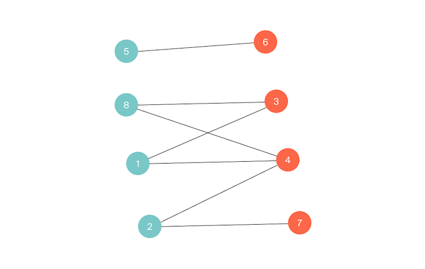

# M. Проверка на двудольность

Немножко теории...

**Определение:** неориентированный граф называется двудольным (англ. bipartite), если его вершины можно разбить на два непересекающихся множества таким образом, что рёбра будут проведены только между вершинами из разных множеств. Эти два множества вершин ещё называют долями.

На рисунке ниже вершины первой доли покрашены в голубой цвет, а второй доли – в красный.

Гоша узнал, что двудольными могут быть не только графы, но и растения (например, сирень). Теперь он в них путается и не может проверить граф на двудольность без мыслей о цветочках. Помогите Гоше: проверьте, является ли заданный неориентированный граф двудольным.

## Формат ввода

В первой строке дано количество вершин n (1 ≤ n ≤ 105) и рёбер m (0 ≤ m ≤ 105). В каждой из следующих m строк записано по ребру в виде пары вершин 1 ≤ u, v ≤ n.

Гарантируется, что в графе нет петель и кратных рёбер.

## Формат вывода

Выведите «YES», если граф является двудольным, и «NO» в ином случае.

### Пример 1

<table><tr>
<td>
3 2 
1 2 
2 3
</td>
<td>
YES 
 
 
</td>
</tr></table>

### Пример 2

<table><tr>
<td>
3 3 
1 2 
2 3 
1 3
</td>
<td>
NO 
 
 
 
</td>
</tr></table>
