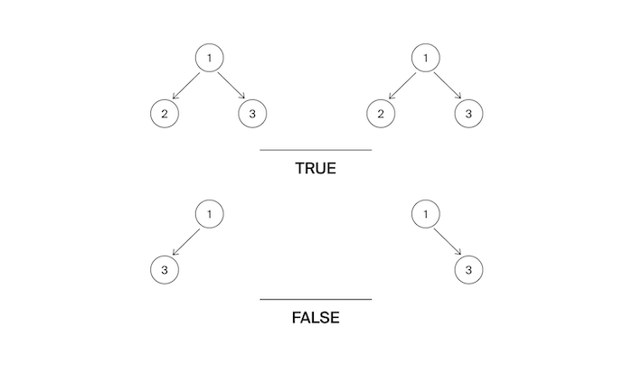

# D. Деревья - близнецы

Гоше на день рождения подарили два дерева. Тимофей сказал, что они совершенно одинаковые. Но, по мнению Гоши, они отличаются.

Помогите разрешить этот философский спор!



## Формат ввода

На вход подаются корни двух деревьев.

**Замечания про отправку решений**

По умолчанию выбран компилятор make.
Решение нужно отправлять в виде файла с расширением, которое соответствует вашему языку программирования.

Go:

```go
package main

/**
Comment it before submitting
type Node struct {  
	value  int  
	left   *Node  
	right  *Node  
}
**/

func Solution(root1 *Node, root2 *Node) bool {
    // Your code
    // “ヽ(´▽｀)ノ”
}
```

## Формат вывода

Функция должна вернуть True если деревья являются близнецами. Иначе - False.