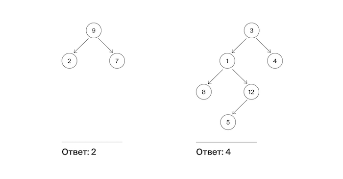

# F. Максимальная глубина

Алла хочет побывать на разных островах архипелага Алгосы. Она составила карту. Карта представлена в виде дерева: корень обозначает центр архипелага, узлы –— другие острова. А листья —– это дальние острова, на которые Алла хочет попасть.

Помогите Алле определить максимальное число островов, через которые ей нужно пройти для совершения одной поездки от стартового острова до места назначения, включая начальный и конечный пункты.



## Формат ввода

На вход подается корень дерева.

**Замечания про отправку решений**

По умолчанию выбран компилятор make. Шаблон для Go:

```go
package main

/**
Comment it before submitting
type Node struct {
	value  int
	left   *Node
	right  *Node
}
**/

func Solution(root *Node) int {
	// Your code
	// “ヽ(´▽｀)ノ”
}
```


