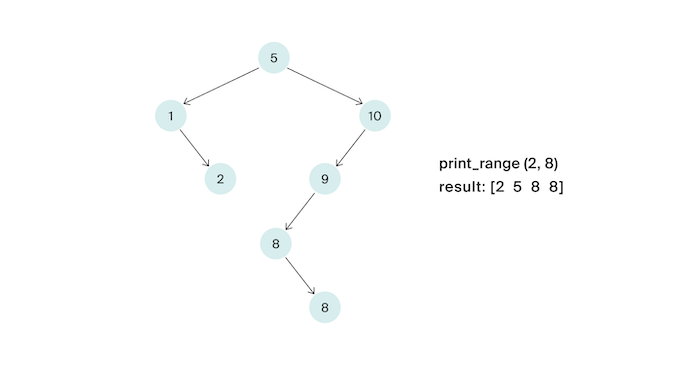

# K. Выведи диапазон

Напишите функцию, которая будет выводить по неубыванию все ключи от L до R включительно в заданном бинарном дереве поиска.

Ключи в дереве могут повторяться. Решение должно иметь сложность  O(h +k), где h –— глубина дерева, k — число элементов в ответе.

В данной задаче если в узле содержится ключ x, то другие ключи, равные x, могут быть как в правом, так и в левом поддереве данного узла. (Дерево строил стажёр, так что ничего страшного).



## Формат ввода

На вход функции подаётся корень дерева и искомый ключ. Число вершин в дереве не превосходит 10<sup>5</sup>. 
Ключи – натуральные числа, не превосходящие 10<sup>9</sup>. Гарантируется, что L ≤ R.

В итоговом решении не надо определять свою структуру / свой класс, описывающий вершину дерева.

**Замечания про отправку решений**

По умолчанию выбран компилятор make.
Решение нужно отправлять в виде файла с расширением, которое соответствует вашему языку программирования.

Go:

```go
package main

/**
Comment it before submitting
type Node struct {
	value    int
	left   *Node
	right  *Node
}
**/


func printRange(root *Node, left int, right int) {
	// Your code
	// “ヽ(´▽｀)ノ”
}
```

## Формат вывода

Функция должна напечатать по неубыванию все ключи от L до R по одному в строке.